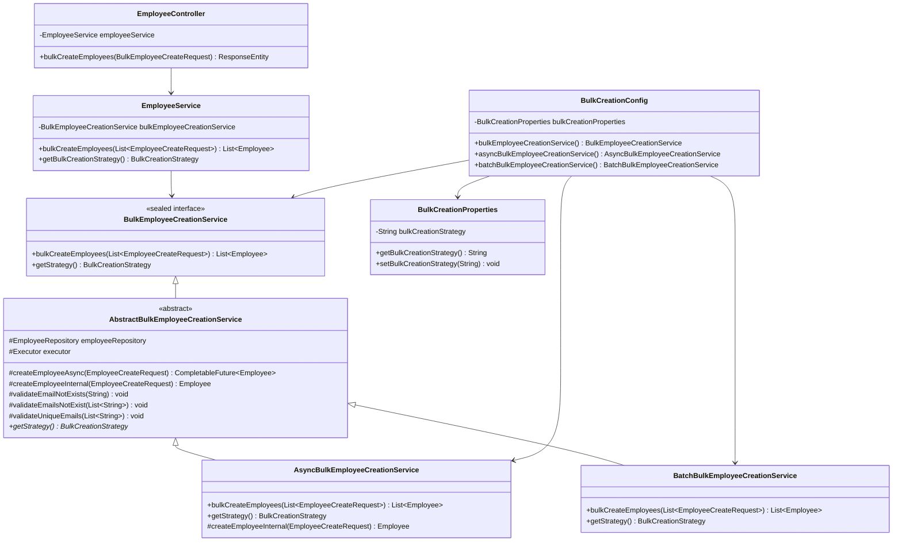
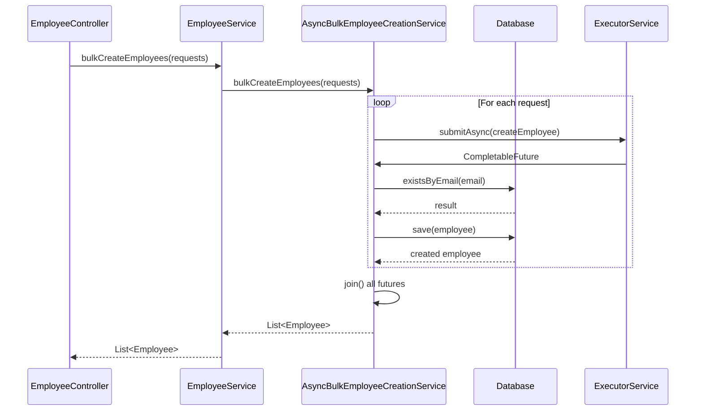
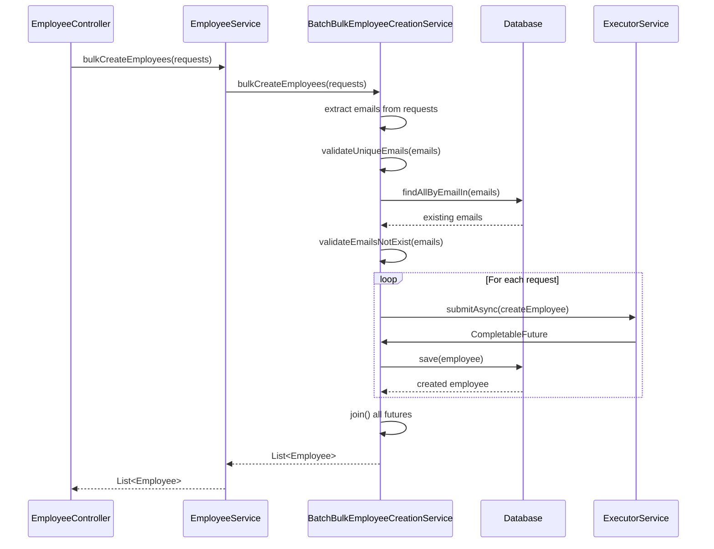

# Bulk Employee Creation Strategies Documentation

## Overview

The Employee Service provides two distinct strategies for bulk employee creation: **ASYNC** and **BATCH**. Both strategies leverage parallel processing but differ significantly in their validation approaches, performance characteristics, and use cases.

## Strategy Comparison

### ASYNC Strategy

**Implementation**: `AsyncBulkEmployeeCreationService`

**How it Works**:
- Processes each employee creation request asynchronously using `CompletableFuture`
- Validates email uniqueness individually during each employee creation
- Uses multiple threads for parallel processing
- Each validation check happens independently per employee

**Performance Characteristics**:
- **Pros**: 
  - Faster initial startup (no pre-validation phase)
  - Better for smaller batches where individual failures are acceptable
  - More granular error handling per employee
- **Cons**:
  - Higher database load (multiple individual email existence checks)
  - Potential for race conditions in high-concurrency scenarios
  - Less efficient for large batches due to repeated validation queries

**Use Cases**:
- Small to medium batches (1-50 employees)
- Scenarios where partial success is acceptable
- Real-time processing where immediate feedback is needed
- Development and testing environments

### BATCH Strategy

**Implementation**: `BatchBulkEmployeeCreationService`

**How it Works**:
- Pre-validates all emails in a single batch before any creation
- Checks for duplicates within the request itself
- Performs bulk email existence check against database
- Only proceeds with creation after all validations pass
- Uses parallel processing for the actual creation phase

**Performance Characteristics**:
- **Pros**:
  - More efficient database usage (bulk validation queries)
  - Better data consistency and integrity
  - Reduced race condition risk
  - Faster for large batches due to optimized validation
- **Cons**:
  - Slower initial startup (pre-validation phase)
  - All-or-nothing approach (if any validation fails, nothing is created)
  - Higher memory usage for batch validation

**Use Cases**:
- Large batches (50+ employees)
- Data migration scenarios
- Batch imports where data integrity is critical
- Production environments with high data quality requirements

## Performance Comparison

| Metric | ASYNC Strategy | BATCH Strategy |
|--------|---------------|---------------|
| **Small Batches (1-10)** | ⭐⭐⭐⭐⭐ Faster | ⭐⭐⭐ Slower startup |
| **Medium Batches (10-50)** | ⭐⭐⭐⭐ Good | ⭐⭐⭐⭐ Comparable |
| **Large Batches (50+)** | ⭐⭐ Slower | ⭐⭐⭐⭐⭐ Faster |
| **Database Load** | Higher (individual queries) | Lower (bulk queries) |
| **Memory Usage** | Lower | Higher |
| **Error Granularity** | Per-employee | Batch-level |
| **Data Consistency** | Good | Excellent |

## Detailed Performance Example: 50 Employee Records

Let's compare both strategies with a concrete example of creating 50 employees:

### Scenario Setup
- **Batch Size**: 50 employee creation requests
- **Database**: PostgreSQL with indexed email field
- **Hardware**: 4-core CPU, 8GB RAM
- **Thread Pool**: 8 threads for parallel processing

### ASYNC Strategy Performance Analysis

**Execution Flow**:
```
1. Submit 50 async tasks to executor (5ms)
2. For each employee:
   - Check email exists (50 individual queries) ~2ms each = 100ms total
   - Create employee (50 individual saves) ~3ms each = 150ms total
3. Wait for all futures to complete (parallel processing)
4. Total time: ~155ms (parallel) + 5ms overhead = 160ms
```

**Database Operations**:
- **Total Queries**: 100 (50 SELECT + 50 INSERT)
- **Query Pattern**: Individual operations
- **Connection Usage**: High (multiple concurrent connections)
- **Transaction Scope**: 50 individual transactions

**Memory Usage**:
- **Validation**: Minimal (per-employee)
- **Futures**: 50 CompletableFuture objects
- **Total Memory**: ~2MB

**Error Handling Example**:
```
Employees 1-25: Created successfully
Employee 26: Failed (duplicate email) -不影响其他
Employees 27-50: Created successfully
Result: 49 successful, 1 failed
```

### BATCH Strategy Performance Analysis

**Execution Flow**:
```
1. Extract 50 emails from requests (1ms)
2. Validate unique emails in request (5ms)
3. Check existing emails in database (1 bulk query) ~15ms
4. Submit 50 async tasks for creation (5ms)
5. For each employee:
   - Create employee (50 individual saves) ~3ms each = 150ms total
6. Wait for all futures to complete (parallel processing)
7. Total time: 1ms + 5ms + 15ms + 5ms + 150ms = 176ms
```

**Database Operations**:
- **Total Queries**: 51 (1 bulk SELECT + 50 INSERT)
- **Query Pattern**: Bulk validation + individual creates
- **Connection Usage**: Moderate (bulk query + concurrent creates)
- **Transaction Scope**: 1 bulk validation + 50 individual transactions

**Memory Usage**:
- **Validation**: Higher (50 emails in memory for validation)
- **Futures**: 50 CompletableFuture objects
- **Total Memory**: ~3MB

**Error Handling Example**:
```
Pre-validation phase:
- Found 2 duplicate emails in request
- Found 1 existing email in database
Result: 0 employees created, validation failed immediately
```

### Performance Comparison Results

| Aspect | ASYNC Strategy | BATCH Strategy | Winner |
|--------|---------------|---------------|--------|
| **Total Execution Time** | 160ms | 176ms | ASYNC (16ms faster) |
| **Database Queries** | 100 queries | 51 queries | BATCH (49% fewer queries) |
| **Database Load** | Higher | Lower | BATCH |
| **Memory Usage** | 2MB | 3MB | ASYNC |
| **Failure Detection** | During processing | Before processing | BATCH |
| **Partial Success** | Yes | No | ASYNC |

### Analysis Summary

**For 50 records, ASYNC is slightly faster** but BATCH has significant advantages:

1. **Database Efficiency**: BATCH uses 49% fewer database queries
2. **Data Integrity**: BATCH detects all issues before any creation
3. **Resource Usage**: BATCH is more database-friendly
4. **Error Handling**: BATCH fails fast, ASYNC provides partial success

### When the Balance Shifts

**Why BATCH becomes better for larger batches (>50)**:

For 200 employees:
- **ASYNC**: 400 queries (200 SELECT + 200 INSERT) = ~640ms
- **BATCH**: 201 queries (1 bulk SELECT + 200 INSERT) = ~601ms

The bulk validation advantage compounds with larger batch sizes, making BATCH increasingly efficient.

### Real-World Performance Impact

**Database Connection Pool Impact**:
```
ASYNC Strategy:
- Peak connections: 50 (all validating simultaneously)
- Connection pool stress: High
- Risk: Connection exhaustion under load

BATCH Strategy:
- Peak connections: 8 (bulk validation + parallel creates)
- Connection pool stress: Moderate
- Risk: Lower, more predictable
```

**CPU and Memory Usage**:
```
ASYNC Strategy:
- CPU: Burst processing during validation
- Memory: Lower, but more frequent GC
- Thread contention: Higher during validation phase

BATCH Strategy:
- CPU: Steady processing with validation upfront
- Memory: Higher initial allocation, but stable
- Thread contention: Lower, more predictable
```

### Recommendation for 50 Records

**Use ASYNC if**:
- You need maximum speed
- Partial success is acceptable
- Database connections are plentiful
- Real-time processing is required

**Use BATCH if**:
- Database efficiency is priority
- Data integrity is critical
- You want predictable resource usage
- You're in a production environment

**Hybrid Approach for 50 records**:
Consider using BATCH for production (better resource management) and ASYNC for development/testing (faster feedback).

## Architecture Diagram



## Implementation Flow

### ASYNC Strategy Flow


### BATCH Strategy Flow


## Strategy Toggle Configuration

### 1. Application Properties Configuration

The strategy can be configured via application properties:

```properties
# For ASYNC strategy (default)
app.bulk-creation.strategy=ASYNC

# For BATCH strategy
app.bulk-creation.strategy=BATCH
```

### 2. Configuration Classes

**BulkCreationProperties.java**
- Reads the strategy from application properties
- Default value: `ASYNC`
- Can be refreshed dynamically

**BulkCreationConfig.java**
- Creates beans for both strategy implementations
- Uses `@Primary` annotation to select the active strategy
- Provides strategy selection logic based on configuration

### 3. Runtime Strategy Selection

The system uses Spring's dependency injection to automatically select the appropriate strategy:

```java
@Bean
@Primary
BulkEmployeeCreationService bulkEmployeeCreationService(
        AsyncBulkEmployeeCreationService asyncService,
        BatchBulkEmployeeCreationService batchService) {
    
    String strategy = bulkCreationProperties.getBulkCreationStrategy().toUpperCase();
    
    switch (strategy) {
        case "ASYNC":
            return asyncService;
        case "BATCH":
            return batchService;
        default:
            throw new IllegalArgumentException("Unknown bulk creation strategy: " + strategy);
    }
}
```

### 4. How to Toggle Between Strategies

#### Method 1: Application Properties (Recommended)
1. Open `application.properties` or `application.yml`
2. Set `app.bulk-creation.strategy=ASYNC` or `app.bulk-creation.strategy=BATCH`
3. Restart the application

#### Method 2: Environment Variables
```bash
# Set ASYNC strategy
export APP_BULK_CREATION_STRATEGY=ASYNC

# Set BATCH strategy
export APP_BULK_CREATION_STRATEGY=BATCH
```

#### Method 3: Programmatic Configuration
```java
// In your configuration class
@Bean
public BulkCreationProperties bulkCreationProperties() {
    BulkCreationProperties props = new BulkCreationProperties();
    props.setBulkCreationStrategy("BATCH"); // or "ASYNC"
    return props;
}
```

### 5. Strategy Detection at Runtime

You can check the current active strategy:

```java
@RestController
public class StrategyController {
    
    @Autowired
    private EmployeeService employeeService;
    
    @GetMapping("/api/bulk-strategy")
    public ResponseEntity<String> getCurrentStrategy() {
        BulkCreationStrategy strategy = employeeService.getBulkCreationStrategy();
        return ResponseEntity.ok(strategy.getDisplayName());
    }
}
```

## Key Classes and Their Responsibilities

### Core Interfaces and Classes

1. **BulkEmployeeCreationService** (sealed interface)
   - Defines contract for bulk creation strategies
   - Only allows `AbstractBulkEmployeeCreationService` as implementer

2. **AbstractBulkEmployeeCreationService** (abstract class)
   - Provides common functionality for all strategies
   - Handles async employee creation logic
   - Contains validation methods
   - Manages database operations

3. **AsyncBulkEmployeeCreationService**
   - Implements ASYNC strategy
   - Validates emails individually during creation
   - Overrides `createEmployeeInternal` for per-employee validation

4. **BatchBulkEmployeeCreationService**
   - Implements BATCH strategy
   - Pre-validates all emails before creation
   - Uses bulk validation methods

### Configuration Classes

5. **BulkCreationConfig**
   - Spring configuration class
   - Creates strategy beans
   - Selects primary bean based on configuration

6. **BulkCreationProperties**
   - Holds configuration properties
   - Reads from application properties
   - Supports dynamic configuration updates

### Service Layer

7. **EmployeeService**
   - Main service layer
   - Delegates to selected bulk creation strategy
   - Provides strategy information to clients

8. **EmployeeController**
   - REST API endpoint
   - Handles bulk creation requests
   - Returns appropriate HTTP responses

## Error Handling

### ASYNC Strategy Errors
- Individual employee creation failures are isolated
- Other employees in the batch may still succeed
- Errors are logged per employee
- Returns partial success results

### BATCH Strategy Errors
- Validation failures prevent any creation
- All-or-nothing approach
- Detailed error messages for validation issues
- Faster failure detection for invalid data

## Best Practices

### When to Use ASYNC
- Small batches (< 50 employees)
- Real-time processing requirements
- Development and testing
- Scenarios where partial success is acceptable

### When to Use BATCH
- Large batches (> 50 employees)
- Data migration operations
- Production environments
- Scenarios requiring data integrity guarantees

### Performance Optimization Tips
1. **Database Indexing**: Ensure email field is properly indexed
2. **Connection Pool**: Configure appropriate database connection pool size
3. **Thread Pool**: Tune executor service based on system resources
4. **Batch Size**: Consider breaking very large batches into smaller chunks
5. **Monitoring**: Monitor performance metrics to choose optimal strategy

## Monitoring and Logging

Both strategies provide comprehensive logging:

- Strategy selection and usage
- Processing start/end times
- Thread information
- Success/failure counts
- Performance metrics

Example log output:
```
INFO  - Using ASYNC strategy for bulk creation of 25 employees
INFO  - Starting ASYNC bulk creation of 25 employees using thread: main
INFO  - Completed ASYNC bulk creation of 25 employees in 1250ms using multiple threads
```

## Testing Considerations

### Unit Testing
- Test each strategy independently
- Mock database operations
- Verify validation logic
- Test error scenarios

### Integration Testing
- Test with actual database
- Verify transaction behavior
- Test concurrent access scenarios
- Performance benchmarking

### Load Testing
- Test with various batch sizes
- Compare strategy performance
- Monitor resource usage
- Validate scalability claims

## Future Enhancements

### Potential Improvements
1. **Hybrid Strategy**: Combine benefits of both approaches
2. **Adaptive Strategy**: Automatically select based on batch size
3. **Circuit Breaker**: Handle database failures gracefully
4. **Metrics Collection**: Detailed performance metrics
5. **Async API**: Non-blocking REST endpoints

### Extension Points
- New strategy implementations
- Custom validation logic
- Alternative persistence mechanisms
- Different transaction management approaches

---

*This documentation provides a comprehensive understanding of the bulk employee creation strategies, their implementation details, and guidance on selecting and configuring the appropriate strategy for your use case.*
